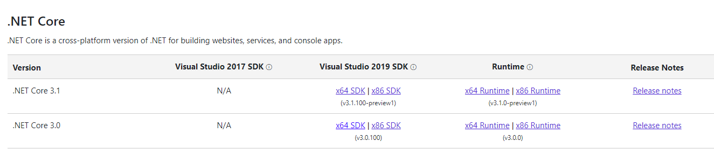

# Démarrer un projet web api dotnet core

On vérifie la version de dotnet core pour le projet

Passons à la [**version 3.0 du framework dotnet core**](https://dotnet.microsoft.com/download/visual-studio-sdks?utm_source=getdotnetsdk&utm_medium=referral).

Téléchargeons la version 3.0 dans un premier temps, puis si vous le souhaitez, vous téléchargerez la 3.1.

Une fois tout installé, vous pouvez choisir **.net core 3.0 pour Visual studio 2019** :

Une fois le projet préparé :

#### Testons-le directement !

Vu que nous avons choisi d'utiliser SSL, nous avons besoin d'un certificat. Il existe un certificat auto-généré que nous pouvons utiliser pour le debogage : 

**Et ça fonctionne !** 

Passons aux explications de cette réussite !

